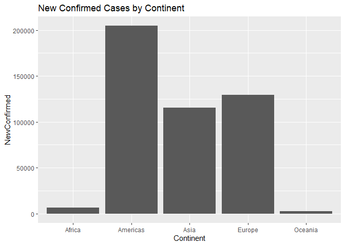

Covid Vignette
================
Xavier Genelin
9/29/2021

-   [Packages](#packages)
-   [Functions](#functions)
-   [Data Exporation](#data-exporation)

## Packages

\-`tidyverse`  
-`httr`  
-`jsonlite`

``` r
library(tidyverse)
library(httr)
library(jsonlite)
```

## Functions

This will be used in each of the functions to get the data from the API.
Just an example for easy copying

``` r
getAPI <- GET("https://api.covid19api.com/all")

dat <- fromJSON(rawToChar(getAPI$content))

as_tibble(dat)
```

    ## # A tibble: 1 x 1
    ##   message  
    ##   <chr>    
    ## 1 Not Found

``` r
# The user can either choose a global summary or country

covidSummary <- function(type = "global"){
  ### you can either select global or country to see the global summary or 
  # the summary by country
  getAPI <- GET("https://api.covid19api.com/summary")
  dat <- fromJSON(rawToChar(getAPI$content))
  
  if(type == "global"){
    output <- as_tibble(dat$Global)
  } else if(type == "country"){
    output <- as_tibble(dat$Countries)
    
    output <- output %>% select("Country", "CountryCode", "Slug", "NewConfirmed", 
                                "TotalConfirmed", "NewDeaths", "TotalDeaths", "NewRecovered", "TotalRecovered", "Date")
  }
  return(output)
}
```

``` r
a <- covidSummary("country")
a
```

    ## # A tibble: 192 x 10
    ##    Country             CountryCode Slug                NewConfirmed TotalConfirmed NewDeaths TotalDeaths NewRecovered TotalRecovered Date              
    ##    <chr>               <chr>       <chr>                      <int>          <int>     <int>       <int>        <int>          <int> <chr>             
    ##  1 Afghanistan         AF          afghanistan                    0         155093         0        7201            0              0 2021-09-29T18:14:~
    ##  2 Albania             AL          albania                        0         168782         0        2668            0              0 2021-09-29T18:14:~
    ##  3 Algeria             DZ          algeria                        0         203045         0        5797            0              0 2021-09-29T18:14:~
    ##  4 Andorra             AD          andorra                        0          15192         0         130            0              0 2021-09-29T18:14:~
    ##  5 Angola              AO          angola                         0          56040         0        1526            0              0 2021-09-29T18:14:~
    ##  6 Antigua and Barbuda AG          antigua-and-barbuda            0           3160         0          76            0              0 2021-09-29T18:14:~
    ##  7 Argentina           AR          argentina                      0        5253765         0      115038            0              0 2021-09-29T18:14:~
    ##  8 Armenia             AM          armenia                        0         259779         0        5277            0              0 2021-09-29T18:14:~
    ##  9 Australia           AU          australia                   1812         102723        23        1279            0              0 2021-09-29T18:14:~
    ## 10 Austria             AT          austria                        0         738763         0       10986            0              0 2021-09-29T18:14:~
    ## # ... with 182 more rows

``` r
getAPI <- GET("https://api.covid19api.com/countries")

dat <- fromJSON(rawToChar(getAPI$content))

as_tibble(dat)
```

    ## # A tibble: 248 x 3
    ##    Country                     Slug                        ISO2 
    ##    <chr>                       <chr>                       <chr>
    ##  1 Montenegro                  montenegro                  ME   
    ##  2 Spain                       spain                       ES   
    ##  3 Colombia                    colombia                    CO   
    ##  4 French Southern Territories french-southern-territories TF   
    ##  5 American Samoa              american-samoa              AS   
    ##  6 Congo (Kinshasa)            congo-kinshasa              CD   
    ##  7 Mayotte                     mayotte                     YT   
    ##  8 Australia                   australia                   AU   
    ##  9 Brazil                      brazil                      BR   
    ## 10 El Salvador                 el-salvador                 SV   
    ## # ... with 238 more rows

Need this because country filters need to be the slug, so the user can
choose anything but return the slug

``` r
getCountry <- function(country, IDType){
  # This will return a tibble with the country name, the country name in lowercase
  # with dashes instead of spaces (slug), and the country code of length 2
  # For example, if we want the United States:
  # country: United States of America, slug: united-states, id: US
  getAPI <- GET("https://api.covid19api.com/countries")
  dat <- fromJSON(rawToChar(getAPI$content))
  data <- as_tibble(dat)
  
  if(IDType == "country"){
    output <- data %>% filter(Country == country) %>% select(Slug)
  } else if(IDType == "id"){
    output <- data %>% filter(ISO2 == toupper(country)) %>% select(Slug)
  } else if(IDType == "slug"){
    output <- data %>% filter(slug == country) %>% select(Slug)
  } else {
    stop("ERROR: Invalid IDType. Should be country, id, or slug")
  }
  
  if(nrow(output) == 0){
    stop("ERROR: Country not found. Check spelling and possible capitalization")
  }
  return(output)
}
```

``` r
getAPI <- GET("https://api.covid19api.com/total/country/united-states/status/death")
dat <- fromJSON(rawToChar(getAPI$content))
data <- as_tibble(dat)

data[1,1] == ""
```

    ##      Country
    ## [1,]    TRUE

``` r
countryTotal <- function(country, IDType, case = "all") {
  # get the total covid numbers for a country by day
  # user has the option to get all numbers or just confirmed, recovered, or deaths
  if(case == "all"){
    main <- "https://api.covid19api.com/total/country/"
    country <- getCountry(country, IDType)
    url <- paste0(main, country)
    getAPI <- GET(url)
    dat <- fromJSON(rawToChar(getAPI$content))
    output <- as_tibble(dat)
    
  } else if(case != "all"){
    main <- "https://api.covid19api.com/total/country/"
    country <- getCountry(country, IDType)
    url <- paste0(main, country, "/status/", case)
    getAPI <- GET(url)
    dat <- fromJSON(rawToChar(getAPI$content))
    output <- as_tibble(dat)
  } 
  if(output[1,1] == ""){
    stop("ERROR: make sure case is either all, confirmed, recovered, or deaths")
  }
  return(output)
}

countryTotal(country= "AL", IDType = "id", case = "recovered")
```

    ## # A tibble: 616 x 10
    ##    Country CountryCode Province City  CityCode Lat   Lon   Cases Status    Date                
    ##    <chr>   <chr>       <chr>    <chr> <chr>    <chr> <chr> <int> <chr>     <chr>               
    ##  1 Albania ""          ""       ""    ""       0     0         0 recovered 2020-01-22T00:00:00Z
    ##  2 Albania ""          ""       ""    ""       0     0         0 recovered 2020-01-23T00:00:00Z
    ##  3 Albania ""          ""       ""    ""       0     0         0 recovered 2020-01-24T00:00:00Z
    ##  4 Albania ""          ""       ""    ""       0     0         0 recovered 2020-01-25T00:00:00Z
    ##  5 Albania ""          ""       ""    ""       0     0         0 recovered 2020-01-26T00:00:00Z
    ##  6 Albania ""          ""       ""    ""       0     0         0 recovered 2020-01-27T00:00:00Z
    ##  7 Albania ""          ""       ""    ""       0     0         0 recovered 2020-01-28T00:00:00Z
    ##  8 Albania ""          ""       ""    ""       0     0         0 recovered 2020-01-29T00:00:00Z
    ##  9 Albania ""          ""       ""    ""       0     0         0 recovered 2020-01-30T00:00:00Z
    ## 10 Albania ""          ""       ""    ""       0     0         0 recovered 2020-01-31T00:00:00Z
    ## # ... with 606 more rows

``` r
getAPI <- GET("https://api.covid19api.com/all")
dat <- fromJSON(rawToChar(getAPI$content))
dat
```

    ## $message
    ## [1] "Not Found"

## Data Exporation

``` r
data1 <- covidSummary(type = "country")

ggplot(data1, aes(x = NewConfirmed, y = NewDeaths)) +
  geom_point()
```

<!-- -->
